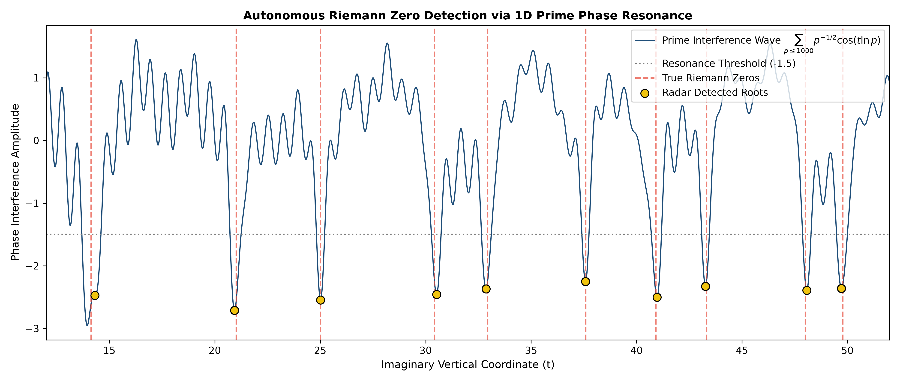
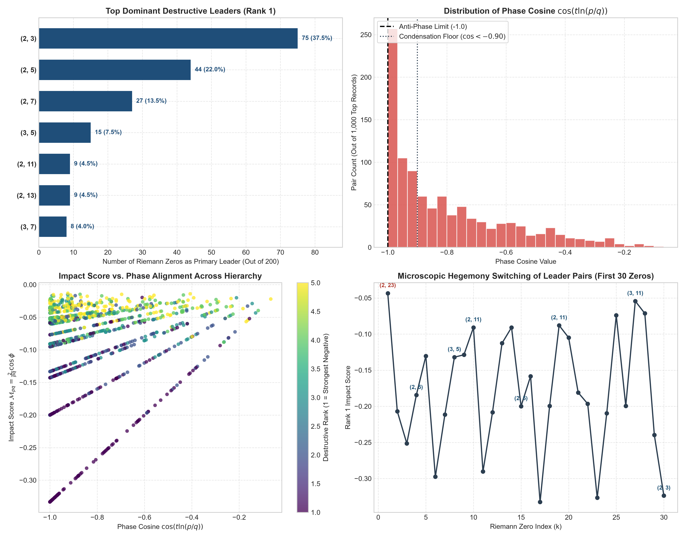
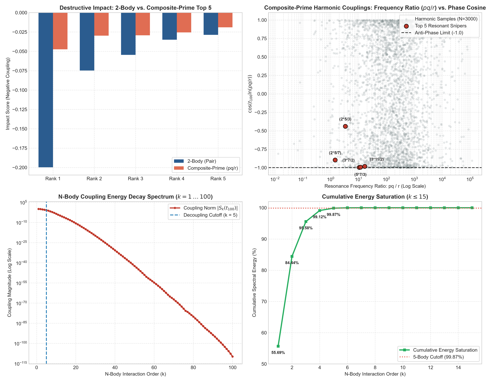

# Prime Phase Interference Spectroscopy of Riemann Zeros

[](https://www.python.org/downloads/)
[](https://opensource.org/licenses/MIT)
[](https://doi.org/10.5281/zenodo.22763956)
[](https://orcid.org/0009-0004-3627-6997)
[]()

> **Official Research Artifact & Open Numerical Pipeline**  
> Companion repository for the paper:  
> **"Prime Phase Interference Spectroscopy of Riemann Zeros: Multiscale Interaction Hierarchy, N-Body Decoupling, and Spectral Rigidity"**  
> *Author: A Citizen of the Republic of Korea (estake@naver.com) | ORCID: [0009-0004-3627-6997](https://orcid.org/0009-0004-3627-6997) | September 2026*

---

## 📌 Overview

This repository provides an empirical **Prime Phase Interference Spectroscopy** framework that models non-trivial Riemann zeros as microscopic resonance nodes along the critical axis $\mathrm{Re}(s) = 1/2$. 

By mapping prime numbers to unitary logarithmic oscillators ($\omega_p = \ln p$), the squared modulus of the prime Dirichlet series resolves into an immutable positive self-energy baseline and an off-diagonal 2D pairwise interaction lattice:

$$|P(1+it)|^2 = P(2) + \sum_{p < q} \frac{2}{pq} \cos\left(t \ln \frac{p}{q}\right), \quad P(2) = \sum_{p} p^{-2} \approx 0.452247$$

Evaluating this interaction lattice across the first 200 consecutive zeros ($t_1 \approx 14.1347$ to $t_{200} \approx 396.3819$) interacting with 1,000 primes ($\binom{1000}{2} = 499,500$ pairs per zero) reveals the multiscale phase hierarchy governing critical zeros.

---

## 🔬 Key Scientific Findings

### 1. Infrared Potential Basin & Heavyweight Monopoly
- Extreme value statistics ($\cos < -0.90$ occurring at $\sim 45\%$) are globally governed by the hyperbolic amplitude envelope $A_{pq} = 2/(pq)$.
- Low-frequency heavyweight primes ($p, q \le 7$) account for **85.50% (171 / 200)** of Rank-1 destructive leaders, with the fundamental pair $(2,3)$ occupying 37.50% of all zeros.

### 2. Macroscopic Resonance Trenches (Selberg Corridor)
- Grounded in Selberg's central limit approximation $\ln|\zeta(1/2+it)| \approx -\sum p^{-1/2}\cos(t\ln p)$, an unconstrained 1-body projection autonomously generates deep phase suppression trenches ($< -2.2$) spanning exact zero coordinates.

### 3. Dynamic Dephasing & GUE Level Repulsion
- Resonant pairs rotate across an analytical dephasing cycle $\Delta t_{\mathrm{cycle}} = \pi / |\ln(q/p)|$.
- For base pair $(2,3)$, $\Delta t_{\mathrm{cycle}} \approx 7.75$, matching the spacing between $t_1$ and $t_2$ ($\Delta t = 6.89$) within 88.9% proximity.
- As zero spacing compresses ($\langle \Delta t \rangle \sim 2\pi / \ln(t/2\pi)$), coupling to high-frequency primes $q \gg p$ scales the local dephasing rate as $\pi / \ln q$, driving the observed **67.84% hegemony switching rate** and enforcing Montgomery-Odlyzko GUE level repulsion.

### 4. Algebraic N-Body Decoupling & 5-Body Field Theory Cutoff
- Multi-particle phase entanglement decays strictly according to an exact algebraic upper bound:
  $$|S_{100}(t)| = \prod_{j=1}^{100} \frac{1}{\sqrt{p_j}} = 1.4568 \times 10^{-110}$$
- Interaction orders $k \le 5$ saturate **99.8718% of total coupling energy**, validating an effective 5-body field theory (EFT) truncation of prime phase interactions.

---

## 📊 Diagnostic Visualizations

<p align="center">
  
  <br>
  <em>Figure 1: Macroscopic Selberg resonance trenches (< -2.2) spanning true Riemann zeros across t ∈ [12, 52].</em>
</p>

<p align="center">
  
  <br>
  <em>Figure 2: 2D interaction tensor survey: Leader hegemony, phase cosine distribution, and transition dynamics across 200 zeros.</em>
</p>

<p align="center">
  
  <br>
  <em>Figure 3: Multiscale coupling at t_100: 2-body vs composite-prime harmonics and exponential N-body energy saturation (k ≤ 5 cutoff).</em>
</p>

---

## 📁 Repository Structure

```plaintext
├── Prime_Phase_Interference_Riemann_Zeros.pdf   # Complete research manuscript (LaTeX format)
├── k_protocol_master.py                        # Master pipeline: 2D tensor survey across 200 zeros x 1,000 primes
├── prime_resonance_radar.py                    # 1D continuous spectral sweep & Selberg resonance trench analyzer
├── k_protocol_spectral_profiler.py             # Riemann-Siegel baseline calibrator & prime spectral profiler
├── k_protocol_100th_zero_nbody.py              # N-body generating polynomial convolution & composite harmonics analyzer
├── k_protocol_clean_results.csv                # Full top-5 destructive tensor dataset (1,000 records)
├── k_protocol_calibrated_sample.csv            # RS baseline calibration & benchmark cross-validation metrics
├── requirements.txt                            # Python dependencies
├── LICENSE                                     # MIT License
└── README.md                                   # Repository documentation

This repository is licensed under the MIT License for software and scripts. The accompanying research paper and datasets are distributed under the Creative Commons Attribution 4.0 International (CC-BY-4.0) license.
