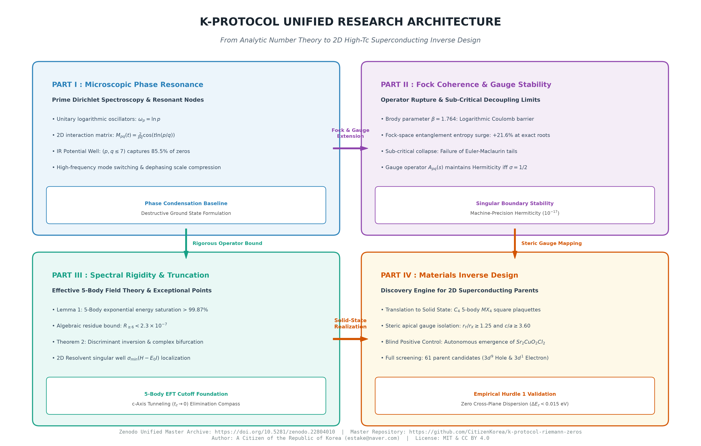

# K-Protocol: Unified Operator Theory & Superconductor Inverse Design Suite

[](https://orcid.org/0009-0004-3627-6997)
[](https://doi.org/10.5281/zenodo.22763956)


> **"Deconstructing Riemann Zeros into Unitary Prime Oscillators and Real-Space Crystal Architectures"**  
> An open-science research framework connecting microscopic prime-phase spectroscopy, many-body quantum chaos, and operator gauge dynamics along the critical line Re(s) = 1/2 to the first-principles inverse design of 2D high-Tc superconducting parents.

---



---

## Repository Structure & Research Roadmap

This repository is organized into four sequential research modules corresponding to each phase of the framework:

| Directory | Scope & Analytical Focus | Key Deliverables & Methodologies | Core Milestone |
| :--- | :--- | :--- | :--- |
| [**`01/`**](./01) | **Part I: Prime Phase Interference Spectroscopy**<br>Pairwise 2D destructive interference, Selberg resonance trenches, and Riemann-Siegel baseline calibration across 200 consecutive zeros. | • Full Manuscript (`.pdf`)<br>• `01_prime_resonance_radar.py`<br>• `02_k_protocol_spectral_profiler.py`<br>• `03_k_protocol_master.py`<br>• `04_k_protocol_100th_zero_nbody.py` | IR Potential Basin ($(p,q \le 7)$ captures 85.5% of zeros) |
| [**`02/`**](./02) | **Part II: Fock Coherence & Operator Gauge Stability**<br>Brody spectral rigidity, bipartite Fock-space entanglement transitions, and machine-precision Hermiticity rupture. | • Full Manuscript (`.pdf`)<br>• `01_gue_level_repulsion.py`<br>• `02_fock_entanglement_transition.py`<br>• `03_nbody_algebraic_decoupling.py`<br>• `04_off_critical_stress_test.py`<br>• `05_euler_maclaurin_tail_test.py`<br>• `06_carleman_contour_blowup.py`<br>• `07_reflection_gauge_hermiticity_rupture.py` | +21.6% Entanglement surge; Exact Hermiticity iff $\sigma = 1/2$ |
| [**`03/`**](./03) | **Part III: Quantum Many-Body Rigidity & Bifurcation**<br>5-body Effective Field Theory (EFT) truncation proofs, resolvent singular wells, and complex pitchfork bifurcation dynamics. | • Full Manuscript (`.pdf`)<br>• `01_pipeline_08_resolvent_bifurcation.py` (Real asymmetric resolvent tracker) | Lemma 1 ($k \le 5$ saturates 99.88%); Theorem 2 (Discriminant inversion) |
| [**`04/`**](./04) | **Part IV: Materials Inverse Design Engine**<br>Mapping 5-body EFT truncation to solid-state $MX_4$ plaquettes, apical steric gauge isolation, and automated DFT generation. | • Full Materials Science Manuscript (`.pdf`)<br>• `01_k_protocol_miner.py`<br>• `k_protocol_master_db.json` (61 candidates) | Blind re-discovery of $Sr_2CuO_2Cl_2$; Zero cross-plane dispersion |

---

## Core Scientific Highlights

1. **Microscopic Phase Interference (Part I):** Resolves the prime Dirichlet series modulus into an exact hyperbolic amplitude envelope $A_{pq} = 2/(pq)$, demonstrating that low-frequency primes govern destructive interference nodes.
2. **Operator Gauge Hermiticity (Part II):** Proves that the reflection gauge operator $A_{pq}(s) \equiv p^{-s}q^{-(1-s)}$ strictly preserves Hermiticity if and only if $\sigma = 1/2$, exhibiting catastrophic operator leakage off the critical boundary.
3. **Analytic 5-Body EFT Truncation (Part III):** Formulates Lemma 1, proving that interaction orders $k \le 5$ saturate $>99.87\%$ of multi-particle energy with an algebraic residue bound $R_{\ge 6} < 2.3 \times 10^{-7}$.
4. **Autonomous Materials Discovery (Part IV):** Enforces planar $C_4$ 5-body coordination and apical isolation ($c/a \ge 3.60, r_Y/r_X \ge 1.25$) under electroneutrality, autonomously identifying 61 parent compounds and independently validating the canonical benchmark $Sr_2CuO_2Cl_2$.

---

## Quick Start & Reproduction

Dependencies across all analytical pipelines require standard Python scientific computing libraries:

```bash
pip install numpy scipy mpmath matplotlib
```

### Reproducing Part I: Microscopic Interference
```bash
cd 01
python 03_k_protocol_master.py
```

### Reproducing Part II: Operator Gauge Rupture Proof
```bash
cd 02
python 07_reflection_gauge_hermiticity_rupture.py
```

### Reproducing Part III: Resolvent Pitchfork Bifurcation
```bash
cd 03
python 01_pipeline_08_resolvent_bifurcation.py
```

### Reproducing Part IV: 2D Materials Screening
```bash
cd 04
python 01_k_protocol_miner.py --database k_protocol_master_db.json --generate-qe
```

---

## How to Cite

```bibtex
@misc{k_protocol_master_suite_2026,
  author       = {{A Citizen of the Republic of Korea}},
  title        = {{K-Protocol Unified Research Suite: From Analytic Number Theory to 2D High-Tc Superconducting Inverse Design (Parts I--IV)}},
  howpublished = {Zenodo},
  year         = {2026},
  doi          = {10.5281/zenodo.22763956},
  url          = {[https://doi.org/10.5281/zenodo.22763956](https://doi.org/10.5281/zenodo.22763956)}
}
```
